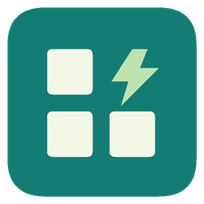

# SaiSuite · 赛赛工具箱



一款面向 Android 和 Windows 的工具箱，将文件处理、图片创作、日常计算和实验前的配液计算放在一起。采用 Flutter、Dart 与 Material 3，提供中文界面、分类搜索、收藏和浅色／深色主题。

当前源码版本为 **1.4.2+11**。[查看本版更新说明](docs/releases/v1.4.2.md)；实际已发布的安装包以 [GitHub Releases](https://github.com/wxia529/SaiSuite/releases) 为准。

## 可以做什么

| 工作台 | 主要能力 |
|---|---|
| PDF | 合并、拆分、页面整理、旋转、图片互转、水印、密码处理、文字提取与信息查看；图片可按各自尺寸生成不同大小的 PDF 页面 |
| 图片与创作 | 全屏图片编辑、格式与尺寸、拼图与长图、图文制作、渐变、九格切图、GIF、幻影坦克、JPEG 信息编辑、图片 OCR 与阈值计数 |
| 视频与画板 | 视频预览、时间轴、截帧、剪辑、静音、音频提取；画板支持缩放、真实擦除、形状、文字和透明 PNG |
| 日常与文字 | 科学计算器、单位换算、随机选择、密码、二维码、文本处理、进制、中文数字、摩斯电码、拼音、日期、秒表与番茄钟 |
| 科研与电解液 | 摩尔质量、配液与稀释、载量与容量、N/P、浆料、盐／溶剂／添加剂配方、实际称量反算、纽扣电池备料与电导率换算 |
| 配色与设备 | 照片主色、锁色随机、色卡导出、放大取色、校准标尺；Android 另提供指南针、水平仪和传感器读数 |

图片取景支持拖动与缩放，图文制作支持移动文字和自定义 emoji。Android 与 Windows 使用统一图标和界面风格。

## 下载与安装

从 [GitHub Releases](https://github.com/wxia529/SaiSuite/releases) 下载对应平台的安装包，文件名中的版本与该次发布一致。

| 平台 | 选择方式 |
|---|---|
| Android 7.0 及以上 | 通常选择 `arm64-v8a.apk`；旧 ARM32 设备选择 `armeabi-v7a.apk`；x86_64 设备选择 `x86_64.apk`；不确定时选择带 `universal` 标识的通用包 |
| Windows 10／11 x64 | 选择 `windows-x64-setup.exe` 安装版，或解压 `windows-x64.zip` 便携版的整个文件夹后运行 `saisuite.exe` |

Android 升级请继续使用原架构的安装包；正式 APK 沿用同一签名。Windows 更新前先关闭应用。每次发布同时提供通用 APK、分架构 APK、Windows 安装版、便携版和 SHA-256 校验文件。

应用默认每天检查一次 GitHub 更新，可在设置关闭，也可手动检查。下载按钮通过 gh-proxy.org 加速，发布页仍可直接打开 GitHub；下载与安装由用户操作。

## 文件与数据

文件处理生成新文件，保留导入原件。科研输入、配方、作品和计数结果不作为实验记录自动保存，需要保留时请主动导出。主题、入口收藏、最近使用、计算器历史、番茄钟状态与标尺校准属于应用设置。

PDF 不提供正文直接编辑、扫描件 OCR、转 Word 或签名验证。图片 OCR 使用单独工作台；Windows 需要系统中文 OCR 语言资源。拍照计数适合分散且反差明显的对象，需要人工核对。传感器结果取决于设备硬件，标尺需要实体尺校准。具体输入限制和使用条件见使用指南。

## 文档

| 文档 | 内容 |
|---|---|
| [使用指南](docs/USER_GUIDE.md) | 安装、各工作台的操作方式、文件限制与平台差异 |
| [开发指南](docs/DEVELOPMENT_GUIDE.md) | 当前范围、代码结构、设计约定与测试要求 |
| [构建说明](docs/BUILD.md) | Android／Windows 环境、签名、调试和打包命令 |
| [发布流程](docs/RELEASING.md) | 版本升级、本地检查、提交规则、tag 与 GitHub Actions |
| [科研口径](docs/SCIENCE.md) | 当前科研功能采用的公式、单位和常量 |
| [依赖与许可](docs/DEPENDENCIES.md) | Flutter、原生服务、桌面组件、字体和数据来源 |
| [发布记录](docs/releases/README.md) | 按版本维护的正式更新说明 |

## 开发入口

```powershell
flutter pub get
flutter analyze
flutter test
flutter run -d <设备ID>
```

默认设备验证使用 `SaiSuite_API_36`，运行前通过 `adb devices` 和 `ro.build.version.sdk` 确认实际设备为 Android 16／API 36。最低支持 API 24，compileSdk／targetSdk 为 36；测试设备选择不会改变这些设置。

`lib/features/catalog.dart` 注册入口，`lib/core/` 处理计算和公共逻辑；Android 与 Windows 的文件、媒体和硬件能力通过平台通道连接。构建环境与完整交付步骤见构建说明。

私钥、密码、设备缓存和安装包不提交到 Git。发现问题可提交 [Issue](https://github.com/wxia529/SaiSuite/issues)，请附平台、复现步骤及去除个人信息后的错误说明。
