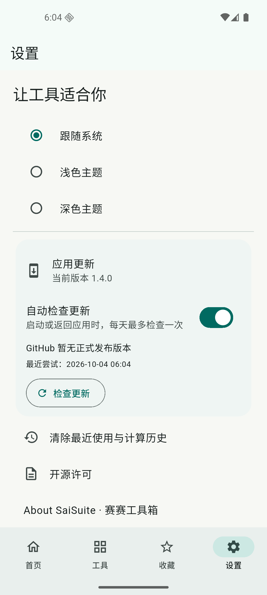

# 验收记录

当前版本为 v1.4.0，共 60 项工具，最新验证见文末。以下各版本记录保留当时的范围与证据；已移除功能不计入当前工具数量。

## v1.0.0 验收记录

日期：2026-10-04。范围：36 项基础工具 + 已确认优先的 10 项电化学扩展 = 46 项。其余 40 项候选没有计入本次完成数量。

## 验证依据

- `flutter analyze`：无问题。
- `flutter test`：64 项逻辑与界面测试通过；其中覆盖全部 34 个非 PDF 工具的默认样例、关键数值、非法输入、Unicode、时区、持久化和窄屏布局。
- Android 设备集成测试：1 个综合测试通过，覆盖 12 项 PDF 共用原生能力、混合纸张、旋转、中文水印、图片页、错误密码、加密往返、损坏文件、500 页边界、取消和原件 SHA-256 不变。
- 正式包：清理 Flutter 构建产物后构建 release，使用专用本地密钥；最终安装包、签名与校验值见本文件末尾。
- 实际设备：Android 17 / API 37 x86_64 模拟器。应用声明 minSdk 24、targetSdk 36，包含 arm64-v8a、armeabi-v7a、x86_64；尚未在每个 Android 版本与实体手机上验证。

测试文件：`test/engine_test.dart`、`test/app_test.dart`、`integration_test/pdf_test.dart`。本机命令日志保存在被 Git 忽略的 `.buildlog/`；源测试可按构建说明重新执行。

## 基础工具逐项验收

| 编号 | 功能 | 验证范围 |
|---|---|---|
| P01 | PDF 合并 | 原生合并得到预期四页，超 500 页拒绝；界面文件顺序与移除入口 |
| P02 | PDF 拆分 | 原生选择页得到单页 PDF；界面三种拆分方式与 ZIP 导出 |
| P03 | 页面提取 | 正式包导入独立三页样本，提取 `3,1` 并保存，pypdf 核对两页顺序、文字和尺寸 |
| P04 | 页面整理 | 原生重复与指定顺序核对；正式界面缩略图、复制和撤销，携带上次输出进入整理 |
| P05 | 页面旋转 | 仅选中第一页旋转 90°，其他页面旋转不变 |
| P06 | 图片转 PDF | PNG/JPEG 两图生成两页横向 A4 文档，页面信息可再次读取 |
| P07 | PDF 转图片 | PNG 与 JPEG 文件签名核对；500 页批量导出可取消，不显示部分成功结果 |
| P08 | 添加水印 | 中文文字水印可渲染，原页文字仍能提取；图片水印输出三页 |
| P09 | PDF 加密 | AES-256 副本，错误密码拒绝、正确密码读取且标识加密 |
| P10 | PDF 解密 | 已知密码解密，标识不再加密，文字层保留 |
| P11 | 文本提取 | 按选页顺序提取；图片 PDF 没有文字层；页面说明不承诺 OCR |
| P12 | 文档信息 | 页数、标题、尺寸、旋转、加密信息与合成样本一致 |
| C01 | 科学计算器 | 运算优先级、幂结合、角度、负数、除零、非法函数；界面结果与持久化历史 |
| C02 | 单位换算 | 默认示例，摄氏/华氏/开尔文、MiB/GiB，跨量纲和绝对零度错误 |
| C03 | 百分比与比例 | 占比默认、25% 变化率、80% 折扣；`2:3=10:15`，零分母拒绝 |
| C04 | 随机选择 | 默认抽签、不重复约束、超额抽取与反向范围拒绝 |
| C05 | 密码生成 | 30 次生成长度和已选字符组验证；安全随机来源，结果不写入历史 |
| C06 | 二维码 | 默认网址真实渲染；超容量输入提示并移除旧结果；PNG 保存/分享入口 |
| T01 | 文本统计 | 默认中文、多码点规则与 `中🧪` 可见字符数 |
| T02 | 文本清理 | 去空格、空行、重复、升序得到 `a\nb` |
| T03 | 文本对比 | 默认样例与 `a\nb → a\nc` 的增删标记 |
| T04 | JSON | 压缩后结构一致；非法 JSON 保留错误字符位置 |
| T05 | Base64 | 中文与 Emoji 编解码往返；非法编码拒绝 |
| T06 | URL 编解码 | 默认编码、中文解码、非法百分号编码的中文错误反馈 |
| T07 | Hash | 默认摘要；`abc` 的 SHA-256 已知值；文件摘要使用流式读取 |
| T08 | 颜色 | RGB 红色、HSL 绿色转换正确；超范围拒绝 |
| S01 | 摩尔质量 | 水、括号、小数计量、水合物；无效元素、零计量、不闭合括号拒绝；118 元素表 |
| S02 | 浓度与配液 | 称量质量、浓度、体积三个方向互相核对，零浓度求体积拒绝 |
| S03 | 稀释 | 默认样例原液 10 mL，输出定容口径 |
| S04 | C-rate | 2 mAh、0.5 C 得到 1 mA，提供反算倍率 |
| S05 | 载量与面容量 | 2 mg、160 mAh/g、1 cm² 得到 0.32 mAh/cm² |
| S06 | 科研能量 | 1 eV 对应约 96.48533 kJ/mol；光子条件说明 |
| D01 | 日期差 | 闰日跨越得到两天，非法非闰年日期拒绝 |
| D02 | 日期推算 | 默认示例与越出年份 1—9999 拒绝 |
| D03 | 时间戳 | 默认 epoch、1970 年以前小数秒取整；非法日期、时间和偏移拒绝 |
| D04 | 时区 | 夏令时季节差异、春季不存在时间、秋季重复时间、非法日期 |

## 十项电化学扩展

| 编号 | 验证范围 |
|---|---|
| EC01 | 12 mm 圆片约 1.13097336 cm²，单面几何面积 |
| EC02 | 0.32 mAh / 2 mg 得到 160 mAh/g，面积归一化保留单位 |
| EC03 | LiFePO4、1 电子理论容量约 169.89 mAh/g，使用 CIAAW 中心值 |
| EC04 | 默认有效 N/P 为 1.09375；长表单在 320 px 宽屏可操作 |
| EC05 | 1 g 干固体、40% 固含量、5% 干粘结剂/5% 溶液时另加溶剂 0.55 g；配比与过量带入溶剂拒绝 |
| EC08 | 20 µL、密度 1.2 g/mL、2 mAh 得到 12 g/Ah |
| EC09 | 10 mL 的 1:1 体积配比，密度 1/2 得到 5/10 g，注明体积近似 |
| EC14 | 25°C、pH 7、0 V vs SHE 约 0.414115 V vs RHE，偏移由用户提供 |
| EC16 | +10 mA、5 Ω 的 0.50 V 校正为 0.45 V；负电流与 50% 已补偿得到 0.525 V |
| EC21 | 1 mA × 3600 s 得到 1 mAh；+1 到 −1 mA 交零点分段各 0.25 mAh；重复/倒退时间与 NaN 拒绝 |

## 界面与文件链路

正式包使用系统 DocumentsUI 从 Download 导入测试 PDF，经 content URI 复制到私有缓存并显示预览。系统另存为成功生成 PDF，外部 pypdf 重新打开验证。单页拆分生成三个文件并保存 ZIP，Python zipfile 校验完整，pypdf 逐项确认每份一页、文字为第 1/2/3 页。系统分享面板显示一个 PDF 附件，未向外部接收方发送。

「继续处理此文件」正确显示提取后的两页；进入页面整理后复制得到三页，撤销恢复两页。正式包导入独立加密样本时要求密码，输入错误后明确显示「密码错误，请重试」。深色主题与页面整理收藏在强制停止并重启后仍存在。开源许可页正常打开，原生 PDFBox 的 LICENSE/NOTICE 随 APK 打包。横竖屏与窄屏在 widget 测试中覆盖 320×700、390×844、844×390；实体设备适配仍需后续用户反馈。

## 限制与后续范围

详见使用说明：100 MB / 500 页是保护边界；500 页样本是文本 PDF，不等同于复杂大扫描件的内存保证。PDF 的复杂书签、表单、批注、原签名、EXIF 方向和旋转页水印需核对实际输出。首版不提供 OCR、正文编辑、压缩、转 Word、签名验证或候选高级电化学分析。

源码构建已经在本机清理 Flutter 产物后验证，尚未在第二台干净机器上复现；未进行应用商店发布。签名材料与 Git 推送相互独立，当前交付为本地源码和 APK。

## 最终安装包

- 路径：`dist/SaiSuite-1.0.0-universal.apk`，66,880,506 字节，约 63.8 MiB。
- 版本：`1.0.0`，versionCode `2`；包名 `io.github.wxia529.saisuite`。
- SHA-256：`cee2ef87a2af197b9b3a8b67db383b948b324ea156ff1a212b58b54d97bbc561`。
- `apksigner verify --verbose`：通过，APK Signature Scheme v2，1 个签名者。
- 实际执行 `adb install -r` 成功，启动正常，已有深色主题与收藏保留；设备包信息确认 minSdk 24、targetSdk 36。
- 正式 manifest 没有 INTERNET 或广泛文件访问权限。分享与系统文件提供器由用户选择；应用本身不上传文件。
- 签名文件 `.private/saisuite-release.jks` 与 `android/key.properties` 被 Git 忽略，需一并安全备份以维持后续覆盖升级。

## 独立架构包补充验收

2026-10-04 按用户要求增加三个独立架构包，保留原通用 APK。`flutter build apk --release --split-per-abi` 成功。

| 文件 | 大小 MiB | versionCode | SHA-256 |
|---|---:|---:|---|
| SaiSuite-1.0.0-arm64-v8a.apk | 29.79 | 2002 | `89308e79dab7c3f250b6be3bf81568813514c95447644b6cb735fd8e51deb6dc` |
| SaiSuite-1.0.0-armeabi-v7a.apk | 27.35 | 1002 | `0ae7ef2d7e92d8908c6116ec624a46b797503ee6f4704e59c8494556e4e17265` |
| SaiSuite-1.0.0-x86_64.apk | 31.20 | 4002 | `84e9ce3df7b1a54812f5a5ec9a1919d6069b01bb1aa032e29b90e45cc8d3f311` |

- `aapt dump badging` 核对每包仅含对应 ABI；包名、版本名、compileSdk 36、targetSdk 36 和 minSdk 24 正确。
- 三包 `apksigner verify --verbose --print-certs` 均通过，证书 SHA-256 为 `86d06951211ad5412b4dd90079a379b46bbc223933b9891599835ff2dd99b250`。
- 每包公共 DEX、资源、对应 ABI 的原生库与通用包逐文件 SHA-256 一致，没有更改工具功能。
- 当前 x86_64 模拟器执行 `adb install -r` 成功，启动显示 46 个工具，原有深色主题与收藏保留，设备包信息确认 versionCode 4002 和 primaryCpuAbi x86_64。
- ARM64 与 ARM32 包完成构建、内容与签名验证，尚未在对应实体设备上安装测试。首页文案调整后，静态检查与 64 项既有测试再次通过。
- 构建和检查日志保存在 `.buildlog/split-release.log`、各 ABI 的 signature 日志与 `split-inspection.json`。安装选择与版本升级规则见使用说明和构建说明。

## 首页文案调整（2026-10-04）

删除右上角「离线可用」及「从一份 PDF 到一次电化学计算，把常用工具放在一起。」说明，并移除相应间距。重新构建 Universal 和三个独立架构包，更新全部校验值；四包签名与 ABI 检查通过。x86_64 模拟器覆盖安装成功，浅色、深色首页均已查看并更新截图，原有收藏保留。

## v1.1.0 新增能力验收（2026-10-04）

63 个入口，包括原 46 项、10 个创作/设备工具及 7 个电解液/即时分析工具；C01 升级点按键盘。实际操作范围见 [v1.1 使用说明](V1_1_GUIDE.md)，数学口径见 [科研口径](SCIENCE.md)。本节为当前交付证据，前文 v1.0.0 安装/偏好状态为当时历史验收。

- `flutter analyze`：无问题。
- `flutter test`：83 项全部通过，覆盖配方质量守恒、纯度、mol/L 密度约束、实际称量反算、数据列映射/重复/基准/步骤时间、样本标准差、键盘选区、配色、计时恢复/暂停、科研结果不自动保存及退出提示、画布输出像素和竖向绘制。
- Android 原生集成 `integration_test/tools_test.dart`：1 项综合测试通过。核对图片信息、裁剪像素、JPEG 拼图、视频元信息/截帧/0.5 秒静音转码与时长、1080p 转码取消、设备参数/传感器清单、3 页 PDF 原生链路；原生输出缓存清理限定调用者文件。
- 最终正式 x86_64 包安装/启动成功，首页显示 63 个工具。点按 `1+3=` 显示 4。画板横向与竖向笔画均正常，画布触摸不会被外层列表抢走。
- 正式包系统另存链路已验证：画板未导出返回提示；取消保存后仍提示未导出，成功保存 900×900 PNG，经 Pillow 重新打开且有实际笔触。图片工具导入该文件、显示 900×900 信息、输出 1024×1024 JPEG，经原生流式 SAF 另存成功，外部重新打开验证格式/尺寸。
- 番茄钟正式包实测：配置 1 分钟、授权通知、退到系统桌面；后台产生 `pomodoro` 通道「专注结束」通知。返回显示 00:00 与下一阶段提示，证据 `timer-start.xml`、`timer-notification.txt`、`timer-resume.xml`。使用非精确系统闹钟，不承诺锁屏/省电场景秒级送达。
- N06 正式包用两个样品、各三圈合成数据完成列映射与分析：对比第 3 圈均值 0.945 mAh，样本标准差 0.00707107；系统导出 CSV 后由 Python 重新读取 6 行，并确认 A 的第 3 圈 CE=94%、保持率约 104.44444444%。保存成功后返回不再提示未导出。
- 新科研输入、分析结果不自动写入偏好设置或实验数据库，不提供配方/装配/样品记录管理。原文件只读；导出是用户主动选择新文件位置。入口收藏与应用设置不属于实验记录。
- 四包均 minSdk 24、target/compileSdk 36、versionName 1.1.0；无 INTERNET、定位、相机或广泛文件访问权限。Media3 带入 ACCESS_NETWORK_STATE/WAKE_LOCK 等基础权限，正式媒体逻辑仅处理本地文件；通知新增 POST_NOTIFICATIONS。
- 四包 `apksigner verify --verbose --print-certs` 通过，沿用 v1.0 同一证书 SHA-256 `86d06951211ad5412b4dd90079a379b46bbc223933b9891599835ff2dd99b250`。每个独立包仅包含对应 ABI，589 项公共代码/资源/对应原生库内容与通用包逐文件一致。

| 文件 | 字节 | MiB | versionCode | SHA-256 |
|---|---:|---:|---:|---|
| SaiSuite-1.1.0-universal.apk | 70,655,020 | 67.38 | 3 | `0b672001c3bd4b185bdb9d8ade18d478d05b2ca0f1cc6d875bb46e60d65ecd2c` |
| SaiSuite-1.1.0-arm64-v8a.apk | 34,190,790 | 32.61 | 2003 | `42acf5026e4bd90573d9e2444dedec468330f6d7c396748234ccba3917f496dc` |
| SaiSuite-1.1.0-armeabi-v7a.apk | 31,665,042 | 30.20 | 1003 | `d4fc6c81a54d2200534db61815b1d6e0405ac99513f11b777c4fe51d9ceb2e27` |
| SaiSuite-1.1.0-x86_64.apk | 35,674,566 | 34.02 | 4003 | `a1f29aa5be7e83c0edae2d121ae0ba911daf21cd466604260331071181993ed9` |

每包同名 `.sha256`，汇总为 `dist/SHA256SUMS.txt`；旧 v1.0 包保留，原汇总为 `dist/1.0.0-SHA256SUMS.txt`。通用包比 v1.0 增加约 3.60 MiB；采用设备编解码器，没有新增 FFmpeg 架构库。

日志：`.buildlog/analyze.log`、`tests.log`、`tools-integration.log`、`release.log`、`split-release.log`、`1.1-*-signature.log`、`1.1-*-badging.log`、`1.1-split-inspection.json`。系统保存证据为 `drawing-cancel.xml`、`drawing-export.xml`、`media-export.xml` 及对应导出文件。集成测试先运行，正式包最后安装，未在带用户数据的手机运行测试；本轮不声称验证了 v1.0 设置跨版本保留。

实体手机传感器精度、屏幕物理刻度和不同设备媒体编码器兼容性尚待现场核对。ARM64/ARM32 已构建与静态检查，未在对应实体设备安装。CSV 分析针对说明中已配对容量或 Li‖Li 明确步骤字段，不宣称读取所有仪器格式；番茄钟通知受系统省电/权限/重启限制。

## v1.1.1 有无表头开关（2026-10-04）

循环数据分析 N06 与锂金属测试分析 N07 增加「文件包含表头」，默认开启。关闭后第一行保留为数据，生成「第 1 列、第 2 列……」供手动映射；支持一行数据，仍限制最多 50000 数据行。切换会使旧解析/映射失效并保留原文，未导出结果先确认；取消保留原模式与结果。合成示例恢复有表头模式，导出 CSV 始终有表头。同步修正开头 BOM 对带引号列名/第一条数据的读取。

- `flutter analyze` 无问题；完整 `flutter test` 89 项通过。新增测试覆盖 CSV/TSV/分号无表头、首行/单行/引号/BOM、列宽错误、50000 行边界、循环/Li‖Li 分析工作线程传递标志，以及两个页面开关与原文保留。
- 正式 x86_64 包覆盖安装成功。通过系统文件选择器导入 3 行、4 列无表头 CSV，分别映射四列并完成循环分析。导出 CSV 用 Python 重新读取确认全部 3 行，第一圈 CE=90%、基准保持率=100%，没有丢弃第一行。
- 尝试切换有表头模式时出现未导出提示；点取消后无表头模式、3 行解析及分析结果保留。证据 `.buildlog/headerless-import.xml`、`headerless-analysis.xml`、`header-change-guard.xml`、`header-change-cancel.xml`、`headerless-export.csv`。
- 四包签名验证通过，沿用原证书，minSdk 24、target/compileSdk 36。每个独立包仅对应 ABI，589 项公共代码/资源/原生库与通用包逐文件一致。本次未改原生服务，未重复运行媒体/PDF 集成；原生验收见 v1.1.0。

| 文件 | 字节 | MiB | versionCode | SHA-256 |
|---|---:|---:|---:|---|
| SaiSuite-1.1.1-universal.apk | 70,687,788 | 67.41 | 4 | `119eb033c3dd57c3cbf4910d23fffc3c06245dac565535960ca9e36fd71cc3e7` |
| SaiSuite-1.1.1-arm64-v8a.apk | 34,190,790 | 32.61 | 2004 | `21a0934e2385595eed96067d6c76a98be0566e447276a3a2cdebd05e9cf7ea39` |
| SaiSuite-1.1.1-armeabi-v7a.apk | 31,697,810 | 30.23 | 1004 | `65ad8baef0cc75bd509efb0c5d1f75b0e88d4744315d13723cc11c20c16c69af` |
| SaiSuite-1.1.1-x86_64.apk | 35,674,570 | 34.02 | 4004 | `95f4b6eb6e2e862ab757750f454cfe9a0a6c6e4a5b9de27fc978fc231edf93aa` |

当前汇总为 `dist/SHA256SUMS.txt`；旧 v1.1.0 四包保留，原汇总为 `dist/1.1.0-SHA256SUMS.txt`。包体/签名证据 `.buildlog/1.1.1-*-badging.log`、`1.1.1-*-signature.log`、`1.1.1-split-inspection.json`。

## v1.2.0 界面与文本工具（2026-10-04）

交付 1.2.0+5，64 个入口。更新内容见 [v1.2 使用说明](V1_2_GUIDE.md)。

- 密码默认 14 位；T09 仅清理中文与英文/数字间空白，测试保留英文词间、数字间、中文间空格、缩进与换行，并覆盖全角字符和扩展汉字。
- 科研/电化学合并栏目，原 ID 与搜索入口保留。
- 图片按单张裁剪、尺寸格式、文字水印和多张拼图进入独立工作台。模拟器「尺寸与格式」真实导出 JPEG，独立解析确认为 1024×2275。
- 配色助手 12 组五色预设、6 种组合、随机灵感。实际点按随机后五色、基色输入与组合方式同步更新；320 px 窄屏布局及 RGB 输入校验通过。
- 取色圆环与圆形放大镜实际显示，拖动可持续更新。800×600 合成图坐标 (408,320) 显示 RGBA (154,193,180,255)，与独立原图像素读取一致；放大镜中心像素另有绘制测试。
- 全屏画板切换和系统返回保留笔迹，320×700 竖屏与 844×390 横屏测试通过。实际切换后导出 PNG 为 900×900，非空笔迹范围为 (230,136)—(670,618)。
- PDF 水印内容、样式、页面分区；文字/图片互斥显示，样式默认折叠，320 px 展开布局通过。模拟器选过水印图片再切回文字，实际导出 3 页 PDF；独立检查每页水印位图为 288×100，对应当前文字，未使用之前的 1080×2400 图片。原生文字水印仍以位图绘制。
- 最终源码 `flutter analyze` 无问题，`flutter test` **99 项全部通过**。Android 17 / API 37 模拟器从 v1.1.1 x86_64 覆盖安装成功。

四包签名证书 SHA-256 均为 `86d06951211ad5412b4dd90079a379b46bbc223933b9891599835ff2dd99b250`，minSdk 24，targetSdk/compileSdk 36。每个独立包仅含对应 ABI；589 个公共资源/代码/对应原生库条目逐项 SHA-256 与 Universal 一致。

| APK | 字节 | MiB | versionCode | SHA-256 |
|---|---:|---:|---:|---|
| SaiSuite-1.2.0-universal.apk | 71,196,500 | 67.90 | 5 | `e276d60fc9338fb930465cfd3059a900418ee1a98f1b0b765d721c2bbb274783` |
| SaiSuite-1.2.0-arm64-v8a.apk | 34,322,674 | 32.73 | 2005 | `6fff8f87f28498704736597857327e9e35f66340908fe5457705c735af6dfd62` |
| SaiSuite-1.2.0-armeabi-v7a.apk | 31,878,846 | 30.40 | 1005 | `9005cd50bc95d2d3677aab981bacf8b8e122f34d84f281bb92ce5f9403ec4d38` |
| SaiSuite-1.2.0-x86_64.apk | 35,871,982 | 34.21 | 4005 | `1f31eea52f4349fe6aa494f907ddba00a433ed456d330c4386a59e0b58ddfdcd` |

汇总为 `dist/SHA256SUMS.txt`，v1.1.1 原四包与汇总 `dist/1.1.1-SHA256SUMS.txt` 保留。构建、架构与签名检查位于 `.buildlog/1.2.0-*.log`、`1.2.0-split-inspection.json`。

## v1.2.1 展示文案清理（2026-10-04）

移除首页「离线工具」、工具数量后的「全部本地处理」、关于页面的「本地处理 · 无账号 · 无上传」、PDF 工作台的「本地处理」和视频工作台的「本地视频处理」。JSON 默认示例改用 enabled 字段，应用介绍同步调整。当前仍为 64 个工具。

静态分析无问题，既有 99 项测试全部通过；本轮为展示文案调整。

模拟器从 v1.2.0 x86_64 覆盖升级成功。已逐页核验首页、工具列表、PDF、视频与关于，界面层级中均未出现相关展示文案；关于版本为 1.2.1。界面证据位于 `.buildlog/1.2.1-{home,tools,pdf,video,about}.xml`。

四包沿用原签名，minSdk 24、targetSdk 36。独立包各含单一 ABI，公共代码和资源与 Universal 逐项校验一致。

| APK | 字节 | MiB | versionCode | SHA-256 |
|---|---:|---:|---:|---|
| SaiSuite-1.2.1-universal.apk | 71,196,500 | 67.90 | 6 | `b3366550ac1bd1a968fb9ee4d8cb57a09fcd5b2249c81fd8f33a1ae9760c90b7` |
| SaiSuite-1.2.1-arm64-v8a.apk | 34,322,674 | 32.73 | 2006 | `841724f25444ec51deb228a94c30d66a9069efb0d9a24e4e5008bc827a2564db` |
| SaiSuite-1.2.1-armeabi-v7a.apk | 31,878,846 | 30.40 | 1006 | `96ae077aa0d39eef89afe58bfa5dc073b1c785541b2e66b2078b0d935468c695` |
| SaiSuite-1.2.1-x86_64.apk | 35,871,982 | 34.21 | 4006 | `4fb7a2dd2aac2946b0e8995501127716477330aed775a39e6eed531b95a7c0d6` |

当前校验汇总为 `dist/SHA256SUMS.txt`；v1.2.0 四包与汇总 `dist/1.2.0-SHA256SUMS.txt` 保留。

## v1.3.0 八个工具界面与指南针刷新（2026-10-04）

- 计算器使用独立显示区、20 键点按键盘、度/弧度分段和折叠科学函数；模拟器默认示例计算为 8.5。
- 单位转换按八种量纲筛选同类单位，交换不改变输入数值；随机选择分选项抽签/随机整数；二维码分文本/网址/Wi-Fi。切换或更改输入会清除旧结果，隐藏网络开关也会使旧二维码失效。
- 番茄钟采用环形倒计时、阶段切换和独立操作按钮。既有 1 分钟专注、暂停剩余 57 秒状态在覆盖安装后保留，后台提醒及暂停取消通知测试继续通过。
- 视频剪辑和截帧分开，时间轴与秒数输入同步；画质、声音和格式说明折叠。实际选取 AndroidX 测试视频（1.024 秒），拖动范围后输入变为 0.21—0.73 秒，成功导出 509,446 字节 MP4；截取第 0 秒另存 PNG，独立解析为 1620×1080。原生测试另验证剪辑时长、静音和取消。
- 画板去掉小方形容器，占满工具栏外的可用区域；全屏保持作品比例。实际绘制三笔后全屏另存，PNG 为 900×1545，非白色范围 (113,238)—(788,1378)，下半部分笔迹完整。窄屏和横屏的全屏切换、撤销/重做与坐标保留测试通过。
- 指南针采用刻度罗盘、四方位与独立读数。仅启用磁场+旋转向量（缺少时回退加速度），水平仪仅启用重力或加速度；原始传感器页维持全部传感器。原生三种模式事件检查通过。
- 指南针角度连续跨越北向，罗盘与静态页面分开刷新，100 ms 插值；相同或小于 0.05° 的目标变化不重新启动动画。测试验证 359°→0°→1°、反向跨界和相同读数不继续安排动画帧。模拟器实际收到磁场变化后方位读数变化；未将模拟器结果视为实体手机性能测量，仍需在用户手机体验。

最终源码静态分析无问题，**117 项单元/界面测试全部通过**，Android 17 / API 37 的原生图像、视频、设备与 PDF 综合集成测试通过。320×700 窄屏、844×390 横屏检查无布局异常；最终 x86_64 包覆盖安装成功。未添加实验记录管理或自动保存实验数据。

四包 minSdk 24、targetSdk/compileSdk 36，原签名证书不变。每个独立包仅含对应 ABI，公共代码、资源和对应原生库逐项 SHA-256 与 Universal 相同。

| APK | 字节 | MiB | versionCode | SHA-256 |
|---|---:|---:|---:|---|
| SaiSuite-1.3.0-universal.apk | 71,476,672 | 68.17 | 7 | `312db9692c5e08a3282b99a65f89deddba1c5a35e6929de9b5caf45856e020a9` |
| SaiSuite-1.3.0-arm64-v8a.apk | 34,455,390 | 32.86 | 2007 | `2048c833b1f82a341651335355af540e4aa4d034f3b2ae68c3e6e1df255e4abd` |
| SaiSuite-1.3.0-armeabi-v7a.apk | 31,962,410 | 30.48 | 1007 | `aa03c43e53509b855813ec817fc4060ce6c25125c44797d65cf00ff9bf4e4417` |
| SaiSuite-1.3.0-x86_64.apk | 35,939,162 | 34.27 | 4007 | `cfe691bc4f52d2b484c92a983542ab2f3e896c40a5ed199886f4b5babfa285da` |

校验汇总为 `dist/SHA256SUMS.txt`，v1.2.1 四包与 `dist/1.2.1-SHA256SUMS.txt` 保留。验证日志：`.buildlog/1.3-tests.log`、`1.3-analyze.log`、`1.3-native-tests.log`、`1.3.0-split-inspection.json`。

界面截图见 [v1.3 使用说明](V1_3_GUIDE.md)，另有 [截帧结果](images/v1.3-video-frame.png)。视频测试素材来自 AndroidX Media 官方测试资源。

## v1.3.1 科研功能范围调整（2026-10-04）

移除 N06 循环数据分析、N07 锂金属测试分析、EC21 电流积分与容量、N02 梯度配方。目录、搜索、首页推荐、路由、分析页面和专用计算实现一并删除，当前共 60 个工具。保留范围见 [v1.3.1 说明](V1_3_1_GUIDE.md)。

- `flutter analyze` 无问题，**107 项单元/界面测试全部通过**。清理已删除功能的测试，新增升级迁移和搜索回归验证。
- 迁移测试核对收藏及最近使用仅移除四个 ID，剩余顺序、主题、计算器历史、番茄钟状态、标尺校准保留；收藏重新排序与重复启动迁移通过。没有清理用户导出文件的操作。
- Android 17 / API 37 模拟器保留 v1.3.0 的数据，先收藏四个待删除工具与科学计算器，再覆盖安装 v1.3.1 x86_64（4007→4008）。升级成功，首页显示 60，收藏仅保留科学计算器；四个 ID 的实际搜索都显示没有匹配的工具。
- 本次未修改 Android 原生 PDF、媒体、传感器服务，未重复运行原生综合集成测试；上一版的原生验收记录见上节。

四包使用同一份源码与原签名证书，minSdk 24、targetSdk/compileSdk 36。独立包各含单一 ABI，公共代码、资源及对应原生库逐项 SHA-256 与 Universal 一致。

| APK | 字节 | MiB | versionCode | SHA-256 |
|---|---:|---:|---:|---|
| SaiSuite-1.3.1-universal.apk | 71,247,076 | 67.95 | 8 | `2b2e2745af07c69dd149a3ad7418ded420b521ba394b79abe7f87a2d87b0870b` |
| SaiSuite-1.3.1-arm64-v8a.apk | 34,389,634 | 32.80 | 2008 | `0014866c5fb088a045ab750985c78d8124f9491154e7d14fa463f0df21735011` |
| SaiSuite-1.3.1-armeabi-v7a.apk | 31,863,886 | 30.39 | 1008 | `b5435d8eafa982cffcf6fc55dc591145e72341908f9367d90cccf3eafb4d1ddc` |
| SaiSuite-1.3.1-x86_64.apk | 35,873,406 | 34.21 | 4008 | `0eb9514a82e96843dbcfff79484e50f9031a3ad1fee3269f3d6c6b5b9d457b26` |

校验汇总为 `dist/SHA256SUMS.txt`；v1.3.0 四包与 `dist/1.3.0-SHA256SUMS.txt` 保留。日志为 `.buildlog/1.3.1-tests.log`、`1.3.1-analyze.log`、`1.3.1-build-*.log`、`1.3.1-split-inspection.json`。升级与搜索证据为 `1.3.1-{before,after}-upgrade-favorites.xml`、`1.3.1-removed-*.xml`。

## Android 13 / API 33 简单兼容检查（2026-10-04）

补装官方 `system-images;android-33;google_apis;x86_64` 镜像，创建测试用 AVD `SaiSuite_API_33`，在 Android 13 / API 33 上安装现有 `SaiSuite-1.3.1-x86_64.apk`（versionCode 4008）。本轮没有修改应用源码或重新打包。

- 正式包安装、启动、目录和搜索正常，首页显示 60 个工具。
- 实际点按计算器等号，度模式 `sin(30)+2^3` 得到 `8.5`。
- 浓度与配液默认样例：151.90 g/mol、1 mol/L、最终体积 10 mL，得到 0.01 mol 和 1.519 g。
- Android 系统文件选择器实际导入独立生成的三页 PDF，文档信息正确识别页数及前两页竖版 A4、第三页横版 A4 尺寸。
- 页面旋转默认 90°，实际经系统保存界面另存 `P05-result.pdf`（1,918 字节）。拉回后用 pypdf 独立解析，三页 `/Rotate` 均为 90，三页原文字全部保留。原始 PDF 的设备端与电脑端 SHA-256 相同，未被改写。
- 检查时应用进程仍正常运行，Android crash 日志为空。本轮为基础手动检查，未重复全部自动测试，也未验证全部 60 项功能、视频编解码或后台计时提醒。该结果仅证明以上项目在 Android 13 模拟器通过，不能替代 Android 7 或实体旧手机验收。

证据保存在 `.buildlog/api33-{home,calculator,science,pdf-information,pdf-saved}.xml`、`api33-smoke-result.json` 与 `api33-P05-result.pdf`。

## 默认测试环境切换至 Android 16 / API 36（2026-10-04）

按用户最新要求，默认开发、设备集成测试和安装包检查改用 Android 16（API 36），取代此前默认 Android 13 的约定。已安装官方 `system-images;android-36;google_apis;x86_64`，创建并启动 `SaiSuite_API_36`（当前 `emulator-5558`）。设备读数确认 SDK 36、Android 16。

现有 v1.3.1 x86_64 正式包安装成功，versionCode 4008，启动状态为 `ok`，首页显示 60 个工具。本轮仅检查环境、安装与启动，未重复完整功能测试；此前 Android 13 的检查记录保留。证据：`.buildlog/api36-home.xml`。应用 minSdk 24、targetSdk/compileSdk 36 保持不变，没有重新打包。

## v1.4.0 GitHub 更新检查（2026-10-04）

新增应用更新区域，默认开启自动检查，可在设置关闭并保存到下次启动；手动检查始终可用。启动或返回应用时按 24 小时节流请求 GitHub 正式 Release，网络失败不阻塞工具使用。发现新版本后显示说明，并通过浏览器打开与当前安装包同分发类型的 APK；不自动下载安装，不将独立架构包回退为较低 versionCode 的 Universal。详见 [更新与发布说明](UPDATES.md)。仍为 60 个工具。

- `flutter analyze` 无问题，**117 项单元/界面测试全部通过**。新增 10 项更新测试覆盖数值版本比较、构建号、正式发布过滤、四种附件匹配、错误/缺失地址、HTTP 404/403/429/500/重定向、超限及损坏响应、连接异常、开关保存、24 小时节流、缓存恢复、异步退出、320 px 窄屏和手动重试。
- Android 16 / API 36 更新综合集成测试 **1 项通过**，检查真实包版本桥、关闭时不请求、手动查询、合成新版本说明、缓存/设置恢复、原生非法地址拒绝，以及真实 GitHub API 请求。合成 v9.0.0 仅存在于测试，未发布公开测试 Release。
- API 36 模拟器窗口打开后，从 v1.3.1 x86_64（4008）覆盖升级至 v1.4.0（4009）成功，既有摩尔质量收藏保留。正式包默认开关为开启；实际关闭、强停再启动后仍关闭；关闭时手动检查正常完成。最后将测试设备开关恢复为开启。
- 本轮查询时公开仓库 wxia529/SaiSuite 尚无正式 Release，实际界面正确显示“GitHub 暂无正式发布版本”。首次 Release 说明已准备在 `docs/releases/v1.4.0.md`，未公开发布或推送源码；真实新版本下载及覆盖安装待后续正式 Release 再验证，本轮已验证版本识别和同架构链接选择。
- 原生 PDF、媒体、传感器与计时实现未修改，本轮未重复它们的完整设备集成测试。

正式包新增 INTERNET 权限用于 HTTPS 更新检查，没有 REQUEST_INSTALL_PACKAGES 或广泛文件读取权限，也没有新增第三方依赖。四包均为 minSdk 24、targetSdk/compileSdk 36，沿用原签名证书。独立包各含对应单一 ABI，其公共代码/资源及对应原生库逐项 SHA-256 与 Universal 相同。

| APK | 字节 | MiB | versionCode | SHA-256 |
|---|---:|---:|---:|---|
| SaiSuite-1.4.0-universal.apk | 72,082,944 | 68.74 | 9 | `3573826bd34bfc15cad93d19f989edb0b8c4cfda2df69bff59d6edba551540bf` |
| SaiSuite-1.4.0-arm64-v8a.apk | 34,652,062 | 33.05 | 2009 | `50bd1de5cedf3871b4cc4831317aac3807e05403f16f5e0e586c4298e2f2c5c9` |
| SaiSuite-1.4.0-armeabi-v7a.apk | 32,175,466 | 30.68 | 1009 | `1a907a9b87528ee8caf7b620113778080debbfeeaa13d009ace356c9561f7f01` |
| SaiSuite-1.4.0-x86_64.apk | 36,135,838 | 34.46 | 4009 | `9a54e5c2b0f98ddcd219b1c6954cbd0737a4beca73f0049b255cd36bb5a34614` |

校验汇总 `dist/SHA256SUMS.txt`；v1.3.1 四包与 `dist/1.3.1-SHA256SUMS.txt` 保留。验证日志：`.buildlog/1.4.0-tests.log`、`1.4.0-analyze.log`、`1.4.0-update-integration.log`、`1.4.0-build-*.log`、`1.4.0-split-inspection.json`。实际开关和升级证据：`1.4.0-{before,after}-upgrade.xml`、`1.4.0-update-{settings,off,off-restart,manual-off}.xml`。

## 图片编辑开发验收（2026-10-04，版本仍为 1.4.0+9，未发布）

「图片工具 → 图片编辑」接入全屏编辑器，支持裁剪、调整、滤镜、文字、箭头、形状、模糊、马赛克和撤销重做。拼图、尺寸与格式、快速文字水印继续保留独立入口。详细限制与使用方式见 [图片编辑说明](IMAGE_EDITOR.md)。

- `flutter analyze` 无问题，117 项单元/界面测试、2 项 API 36 图片编辑集成测试通过。设备实际 SDK 为 36，AVD 为 `SaiSuite_API_36`。
- 真实 Android 系统保存界面首次取消、第二次保存，验证取消不标记成功且退出仍提示，保存成功后退出无未保存提示。原始输入 SHA-256 保持不变。
- 保存后的透明 PNG 独立解析为 320 × 160，保留透明角落和中文标注；正式模式测试包通过系统选图、1:1 裁剪和 JPEG 导出，独立解析结果为 RGB、160 × 160。
- Universal 和三种 ABI 测试包均保持原版本及构建号规则，验证原签名证书、minSdk 24、targetSdk 36 和对应 ABI。沿用原生库，主要体积增量来自 Dart 编辑器代码。

四包及最终校验报告单独存放在 `dist/development/image-editor/`，未覆盖正式 APK、未推送标签或发布 Release。单元、集成、构建日志及导出文件保存在 `.buildlog/image-editor-*`。旧设备上的大图内存和实体硬件表现尚未专项验证。

## 工作台升级开发验收（2026-10-04，版本仍为 1.4.0+9，未发布）

电解液输入改为组分卡片与实时结果；拼图增加模板、换位、逐格裁剪和长图；配色增加锁色、排序、单色编辑、色卡导出及照片主色联动；画板支持双指操作、真正擦除、透明背景、形状与可移动文字；视频接入内嵌播放器、缩略图时间轴和片段循环；PDF 保留轻量工具，增加全屏预览和网格多选。完整限制见 [工作台升级说明](TOOL_UPGRADES.md)。

- `flutter analyze` 无问题，126 项单元/界面测试通过，覆盖双指缩放不误画、文字移动撤销、锁色随机、透明擦除、无效配方清除旧结果与质量溢出拒绝。
- 2 项 API 36 工作台集成测试通过。验证拼图实际像素、PDF 全屏翻页、多选及重复页转换，视频缩略图尺寸、实际截帧、内嵌播放、选段与整段末尾循环、1 秒片段输出为 360p，以及源文件 SHA-256 不变。
- 开发安装包保持 1.4.0+9；universal 和三种 ABI 独立存放在 `dist/development/tool-upgrades/`，最终包签名、平台、架构、体积和哈希以 `inspection.json` 为准。没有推送、发标签或覆盖正式发行包。
- 大图与长视频在旧设备上的实际性能、真实硬件音画同步尚未专项验证。测试视频只用于调试缓存，不打入安装包。

## 图片原尺寸转 PDF 开发验收（2026-10-04，版本仍为 1.4.0+9）

新增“页面尺寸 → 按图片尺寸”。每张图片生成独立页面，1 px = 1 pt（72 dpi），不裁剪、不加边距、不降低像素；EXIF 方向校正，PNG 透明通道保留，完整解码后无损封装。原有 A4、Letter 模式通过回归检查。安全边界及说明见 [工作台升级说明](TOOL_UPGRADES.md)。

127 项单元/界面测试通过，新增 API 36 原生集成测试通过：5000×200、240×480、8 种 EXIF 方向混合生成 10 页 PDF，页尺寸与图像尺寸一致。pypdf 独立解码与对应源图逐像素 RGBA 差异为 0，Poppler 渲染正常，所有源图 SHA-256 不变；1600 万像素以上明确拒绝，未自动缩小。开发包四种架构及校验文件独立保存在 `dist/development/pdf-original-size/`。

## Windows 桌面版（保持 1.4.0+9）

- 57 项现有工具：PDF、图片、视频、计算、日期、科研与电化学；手机传感器三项在 Windows 隐藏，不恢复已删除的 CSV 工具。
- Windows 10 22H2 x64、Visual Studio Enterprise 2026 18.10.3、Flutter 3.47.6；Release 与 Debug 均编译成功。Windows 11 未另行验收。
- 静态分析无问题；128 项单元/界面测试、3 项 Windows 桌面集成、5 组随包后端验证通过；后端包含 AES-256、中文水印、RGBA 原尺寸、EXIF、真实 H.264/AAC、音频保留/静音。
- 桌面集成验证专属缓存清理不会删除共享 TEMP 中两天前的输入，原文件哈希不变；查看实际桌面首页截图 `.buildlog/windows-home.png`。
- 默认设备 emulator-5558 实际 API 36；两项 PDF/拼图/视频回归通过，主程序重新启动到调试首页。第一次回归缺测试素材的失败已补齐素材并重新通过。
- ZIP 解压到含中文、空格的新目录后，全部文件哈希、ZIP CRC、x64 PE 和 CRT 完整性通过，使用解压包自带解释器执行五组真实后端测试；脱离原构建目录的 Release EXE 隐藏启动，进程保持响应，资源版本 1.4.0+9。
- 产物 `dist/development/windows/SaiSuite-1.4.0-windows-x64.zip`，111,527,208 字节（106.36 MiB），923 个校验文件；SHA-256 `ba5f052e9138c0b90eb746de99c0fc33a6d2eb86077c502b809ac4646fd95df9`。
- 16 项发布脚本测试通过，包含 Windows 包缺失或校验错误时禁止发布；GitHub 工作流 YAML 已校验。远端 Windows Actions 尚未执行，本轮未推送、发布或创建标签。
- Windows 程序没有 Authenticode 签名；原 Android 密钥和正式 APK 保留。便携包说明及完整平台限制见 [Windows 说明](WINDOWS.md)。

## Windows 安装包（2026-10-04，保持 1.4.0+9）

- 中文 Inno Setup 向导：按当前用户安装，目录与开始菜单位置可选，桌面快捷方式可选；提供 Windows 应用列表和开始菜单卸载入口。默认路径为 `%LOCALAPPDATA%\Programs\SaiSuite`。
- `SaiSuite-1.4.0-windows-x64-setup.exe`：83,277,006 字节（79.42 MiB），SHA-256 `69e156674fd21363e0d2e9a3026bc349bee6da0d839b257233404c0ca938063c`。
- 保留并更新便携 ZIP：111,527,772 字节（106.36 MiB），SHA-256 `0bad8e65acdbfb328351e0cc4c8c3c53bc9e6a17c6f1533dce95c1251e123913`；本节校验值取代上节初次便携包记录。两种产物均位于 `dist/development/windows/`，各自附校验文件。
- 真实安装到中文和空格路径，校验 923 个文件；注册表版本、快捷方式、重复安装、已安装程序启动与五组随包后端验证通过。
- 程序运行时安装和卸载均被拦截，未关闭测试进程；停止该测试进程后卸载成功。卸载入口和测试快捷方式移除，用户加入安装目录的文件、目录外导出结果和实际偏好文件均保留。报告 `.buildlog/windows-installer-verification.json`，日志 `.buildlog/windows-installer-test-e501d5c1/`。
- 最终 ZIP 的 CRC、全部文件哈希、x64 PE、CRT，以及脱离构建目录的五组随包后端验证再次通过，报告 `.buildlog/windows-portable-verification.json`。
- 静态分析无问题、128 项单元/界面测试及 17 项发布脚本测试通过。更新优先匹配安装 EXE，旧发布回退 ZIP；测试覆盖缺失、篡改安装包阻止发布和完整十三项附件发布。
- Actions 已包含 Windows 安装 EXE、ZIP 和校验文件，仍由 tag 正式构建并发布；工作流 YAML 校验通过，远端尚未执行。没有改版本号、推送、创建标签或公开发布；Windows 安装包仍无 Authenticode 证书签名。

## 22 项创作、文字与日常扩展（2026-10-04，保持 1.4.0+9）

用户选定的工具全部加入：时间屏幕、手持弹幕、分段秒表、记分牌、反应力、进制、中文数字、上下标、摩斯、迷你英文、拆分选词、拼音、渐变、九格、GIF、表情、文字转图、幻影坦克、照片信息、OCR、拍照计数、视频音轨。Android 共 82 项，Windows 共 79 项。各工具采用独立工作台、分组参数与效果预览；未新增实验记录或自动保存。完整行为和边界见 [扩展功能说明](CREATIVE_TOOLS.md)。

- 静态分析无问题，138 项单元／界面测试通过。新增 10 项测试覆盖计算与编解码、Unicode、实际图片像素、GIF 帧时长和 Flutter 播放次数、阈值计数及 22 个工作台窄屏初始化。
- Android `emulator-5558` 实际 SDK=36；三项设备集成通过，覆盖中英文 OCR、JPEG EXIF 修改／清除、原件与图像像素保持、实际 AAC 音轨以及文字卡片／秒表绘制。
- Windows 三项创作集成通过，并验证无边框全屏进入与恢复。查看真实文字卡片截图，修正过高预览。便携包搬到中文／空格路径后，随包 OCR 脚本实际识别文本成功，源图哈希不变。
- 新 Windows 安装包验证 924 个文件：真实安装／重复安装／卸载、快捷方式、运行中安装卸载保护、偏好和用户文件保留全部通过。安装包和便携包的五组 PDF／图片／视频后端验证通过；便携包 CRC、文件哈希、x64 PE、CRT 完整性通过。
- 四个 APK 检查版本、minSdk 24、targetSdk 36、对应 ABI、原证书，以及随包中文 OCR 模型和每种 ABI 的原生识别库。Universal 与三个分包均为本轮新构建，文件附 SHA-256。
- 集成测试与正式构建顺序执行。首次发布构建遇到生成的集成测试插件注册冲突，已重建并成功；未把失败构建产物作为最终包。主程序随后恢复到 API 36 调试模拟器。

拍照计数按反差明显、分散的圆片／颗粒实现，粘连遮挡需手动增删；没有宣称任意物体 AI 计数。Windows OCR 依赖系统中文语言资源；Android 随包包含中文模型。EXIF 仅编辑 JPEG 和 ASCII 文本，保留方向，其他 XMP 元数据不承诺清除。Android 音轨直接提取支持 AAC，其他编码可先用已有视频转换。真实厂商相机回调与旧设备大图性能尚未专项验收。

本轮产物独立存于 `dist/development/creative-tools/`，以前的包全部保留。未改版本、推送、创建标签或发布 Release；Android 沿用证书 `86d06951211ad5412b4dd90079a379b46bbc223933b9891599835ff2dd99b250`，Windows 仍无 Authenticode 签名。

| 产物 | 字节 | MiB | SHA-256 |
|---|---:|---:|---|
| SaiSuite-1.4.0-universal.apk | 120,794,138 | 115.20 | `c62a1ff3478809d1ccc1aaae3009b84c299670bccfb100e3c95596ee4d9c26b2` |
| SaiSuite-1.4.0-armeabi-v7a.apk | 48,086,649 | 45.86 | `29520e1667503dd7665d2b9c618f8d435ef1c844372341075770f188d0330ff7` |
| SaiSuite-1.4.0-arm64-v8a.apk | 53,811,031 | 51.32 | `5fda0e977459401313de075cd62d71e7d8bc3bdeab7fa9328747f3a80b16c79e` |
| SaiSuite-1.4.0-x86_64.apk | 55,978,232 | 53.39 | `26b8eeba835ee204b7fb2a22c0c5ef0fd6453058b9446d7cc84d4cdc6ffe4245` |
| SaiSuite-1.4.0-windows-x64-setup.exe | 83,943,593 | 80.05 | `4ac8dd88d66eed72509cb7fc2c980269f05c96d465c7ef98a57b024f8181c896` |
| SaiSuite-1.4.0-windows-x64.zip | 112,441,718 | 107.23 | `fcee2f7b26999671fb0163bdc38634acecaa3f7f48c8986d12cbafe5f93fb9b2` |

日志为 `.buildlog/creative-{analyze,unit-tests,android-integration,windows-integration,android-release,android-split,windows-release,installer-verification,portable-verification}.log`；APK 检查为 `dist/development/creative-tools/android/inspection.json`。Windows 验证 JSON 记录当前包路径、哈希及安装测试目录，搬迁后 OCR 结果在 `.buildlog/creative-packaged-ocr.json`。

## 用户授权升级至 1.4.1+10（2026-10-04）

用户明确要求升级版本号，将 `pubspec.yaml` 和应用显示版本同步为 1.4.1+10。工具仍为 Android 82 项、Windows 79 项。计算导出 JSON 使用统一 `appVersion`；新增 `docs/releases/v1.4.1.md`，发布与安装校验脚本从当前版本读取参数，不再写死旧版。

- 静态分析无问题，21 项应用／更新测试、17 项发布脚本测试通过。功能完整验收沿用上节，版本改动未重复全部功能集成。
- 四个新 APK 通过版本、架构、SDK、原证书和随包 OCR 模型检查，versionCode 为 universal 10、ARM32 1010、ARM64 2010、x86_64 4010；签名不变。
- 默认模拟器 `emulator-5558` 实際 SDK=36，正式 x86_64 包从 1.4.0／4009 通过 `adb install -r` 覆盖到 1.4.1／4010，并启动主程序。没有先卸载旧版。
- Windows Release EXE 的 FileVersion／ProductVersion 为 1.4.1+10，数字资源为 1.4.1.10；安装注册表 DisplayVersion 为 1.4.1+10。
- Windows 安装、重复安装、卸载、924 个文件哈希、运行中保护、用户文件与偏好保留通过；安装版与 ZIP 便携版分别通过五组随包后端验证。ZIP CRC、x64 PE、CRT、中文／空格搬迁目录检查通过。
- 测试后使用带默认 pub 步骤的 release 构建重新生成插件注册表；Windows 构建脚本已移除 `--no-pub`，避免携带测试注册信息。首次 Android 构建遇到残留引用后已重新生成并成功。
- 新包独立放在 `dist/development/1.4.1/`；上一轮 Android universal、Windows EXE 与 ZIP 的哈希复核不变。未推送、创建标签或发布；可在确认发布时使用 `v1.4.1+10`。

| 产物 | 字节 | MiB | SHA-256 |
|---|---:|---:|---|
| SaiSuite-1.4.1-universal.apk | 120,794,134 | 115.20 | `3fcc9b991a85865afffb96e21e11cb4c772bab6da4c37b111d008cc156c99e9f` |
| SaiSuite-1.4.1-armeabi-v7a.apk | 48,086,645 | 45.86 | `1cd9f9cc07be83ade88d729140c3a8ffe285226a2e6713a88e2af61a8196c6bc` |
| SaiSuite-1.4.1-arm64-v8a.apk | 53,811,031 | 51.32 | `7bee6daec3b305ff590097ff11daf85b100ce349a86cdf40649d6abaca5caf61` |
| SaiSuite-1.4.1-x86_64.apk | 55,978,232 | 53.39 | `950b4d143f7b11bcd8fe93d997827c5333ad9d905e0ed4adfb4d8ad4eb37cc01` |
| SaiSuite-1.4.1-windows-x64-setup.exe | 83,938,957 | 80.05 | `29dbcabdef1791bf9dce2faac7b31488d318bbcd73654561032585ba5c575d4a` |
| SaiSuite-1.4.1-windows-x64.zip | 112,441,743 | 107.23 | `0c869c18d16b170bc0754fe8057bef7bc259b5be13d043ecf1ceed13ddab8992` |

本轮日志与报告为 `.buildlog/1.4.1-*`；Android 同目录提供 `inspection.json`、四份 `.sha256` 及 `SHA256SUMS.txt`；Windows EXE／ZIP 各有 `.sha256`。
