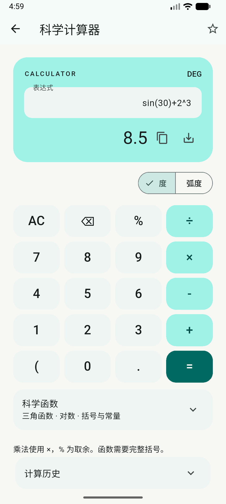
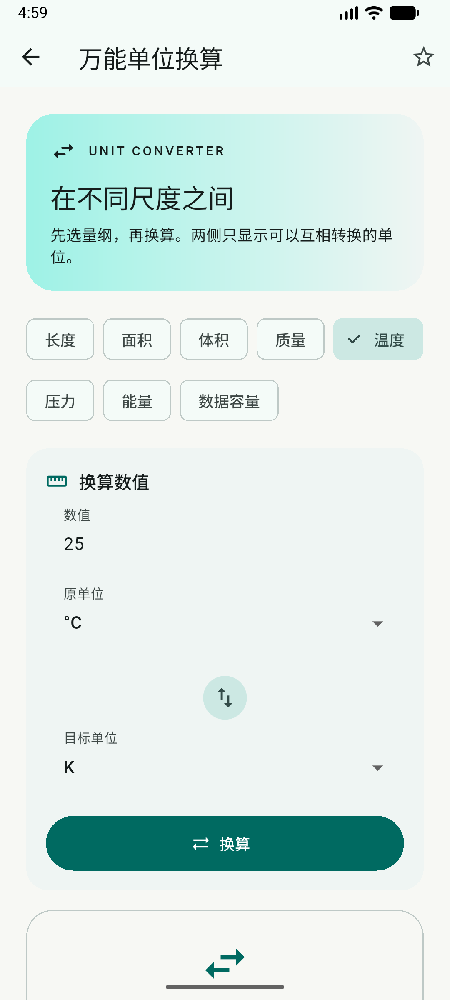
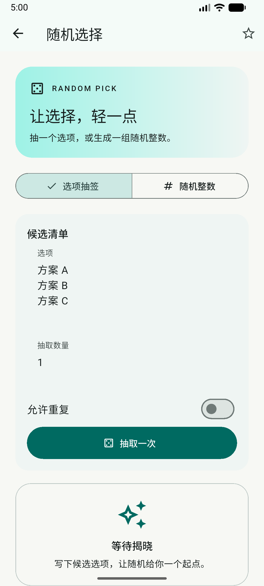
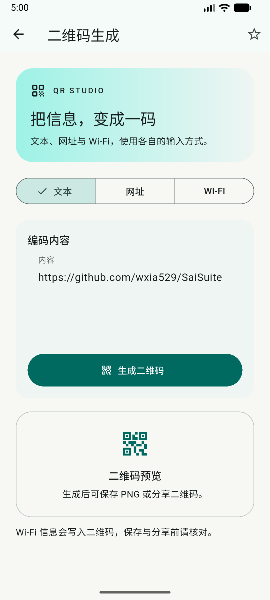
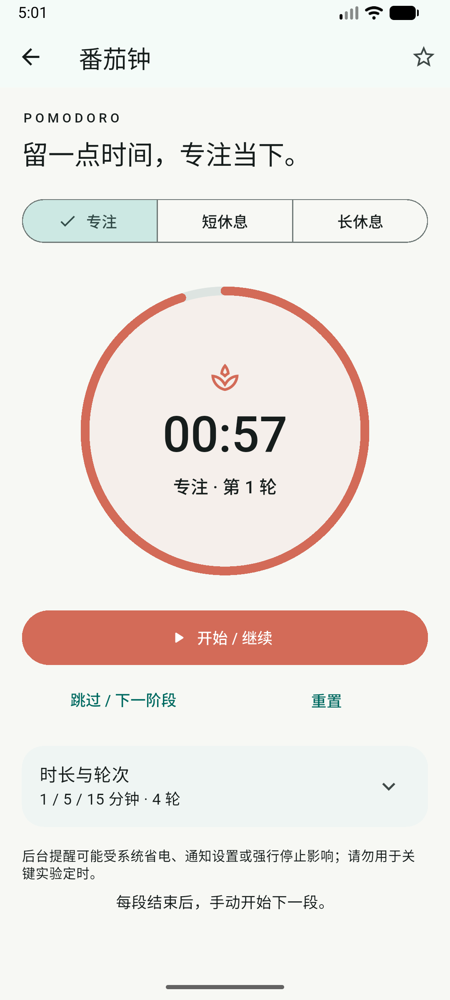
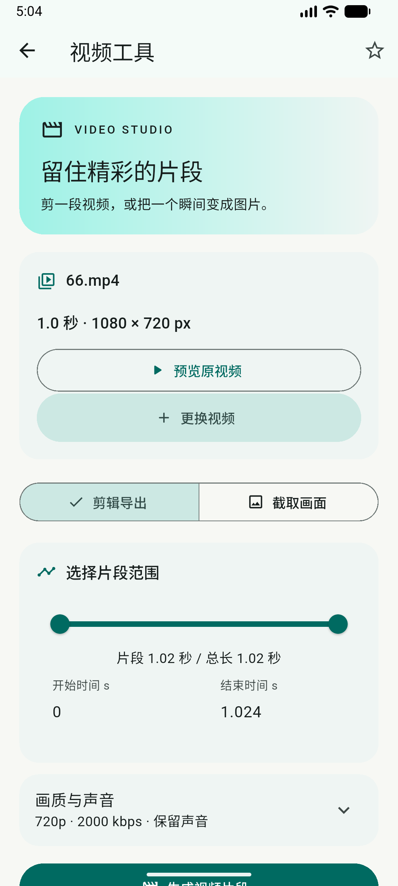
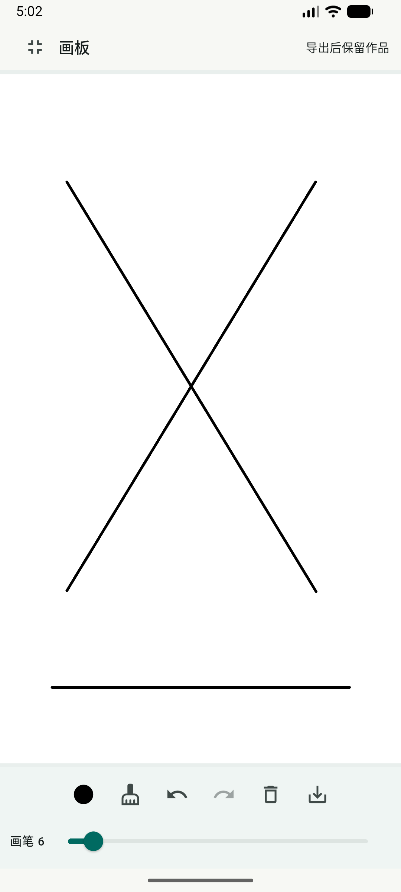
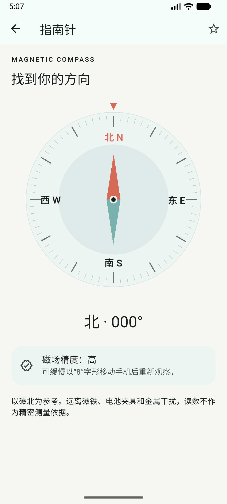

# v1.3 常用工具与画板

当前版本更新：v1.3.1 按用户要求移除 N02 梯度配方、N06 循环数据分析、N07 锂金属测试分析、EC21 电流积分与容量，共 60 项工具。以下旧版本范围、说明与候选规划保留为历史参考；被移除的功能不属于当前手机版，见 [范围调整](V1_3_1_GUIDE.md)。

版本：1.3.0+7，2026-10-04。仍为 64 个工具，这次重做八个工具的操作界面。

| 工具 | 操作方式 |
|---|---|
| 计算器 | 上方显示表达式和结果，下方点按键盘；`=` 计算，AC 清空，⌫ 删除。角度模式在度/弧度之间切换。科学函数和可点选计算历史分别展开。% 是取余。 |
| 单位转换 | 先选长度、质量、温度等量纲，再输入数值；两侧仅列出同量纲单位。中间按钮交换原单位和目标单位。 |
| 随机选择 | 选项抽签与随机整数分别输入，每个候选占一行；设置数量和是否允许重复后抽取。 |
| 二维码 | 文本、网址、Wi-Fi 三个模式；只有 Wi-Fi 显示 SSID、加密、密码和隐藏网络。生成后可保存 PNG、复制内容或分享。 |
| 番茄钟 | 环形倒计时显示当前阶段和轮次；开始/暂停、跳过、重置各自独立。停止时可选择阶段。时长与轮次在折叠设置中调整，修改后重置应用。 |
| 视频 | 先选素材，可预览原视频；剪辑导出与截取画面分别进入。拖动范围时间轴或单点时间轴，也可直接输入秒数。剪辑模式的画质、目标码率和静音单独折叠。生成后预览并另存。 |
| 画板 | 画布使用工具栏外的全部可用区域；底部为颜色、橡皮、撤销、重做、清空、导出与粗细控制。顶部可进入全屏。 |
| 指南针 | 罗盘刻度、四方位、北向指针与数字读数配合显示；方向平滑跨越 0°，磁场精度和校准提示显示在下方。 |

画板创建时按当前可用区域确定作品比例，导出宽度为 900 px，高度按比例确定（300—4096 px）。之后旋转屏幕或进入全屏会按原比例适配显示，已有笔迹和坐标保持稳定；不会拉伸作品。离开未导出画板仍会提示。

视频保持原文件，MP4 使用 H.264/AAC，截帧输出 PNG；500 MB 文件上限、编码能力和目标码率限制与此前相同。未导出结果的替换和退出仍需确认。

指南针只采集磁场与旋转向量，缺少旋转向量时使用加速度；水平仪仅采集重力或加速度。原始传感器页继续显示全部可用传感器。罗盘动画与静态页面分开刷新，采样间隔约 33 ms，变化时在 100 ms 内插值；相同读数不重启动画。读数为磁北，测量精度受手机传感器和周围磁场影响；这次不新增实验记录存储。

安装包同时提供 Universal、ARM64、ARM32、x86_64。手机一般选 ARM64，不确定架构可选名称带 universal 的通用包。覆盖升级需保持签名及架构对应关系，详见构建说明。

## 界面截图

